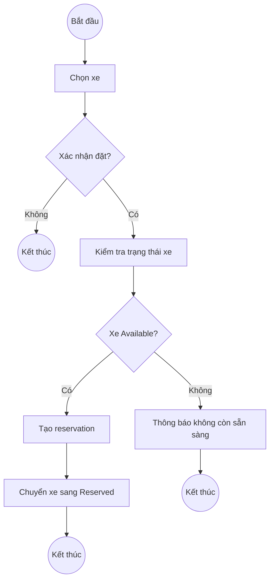
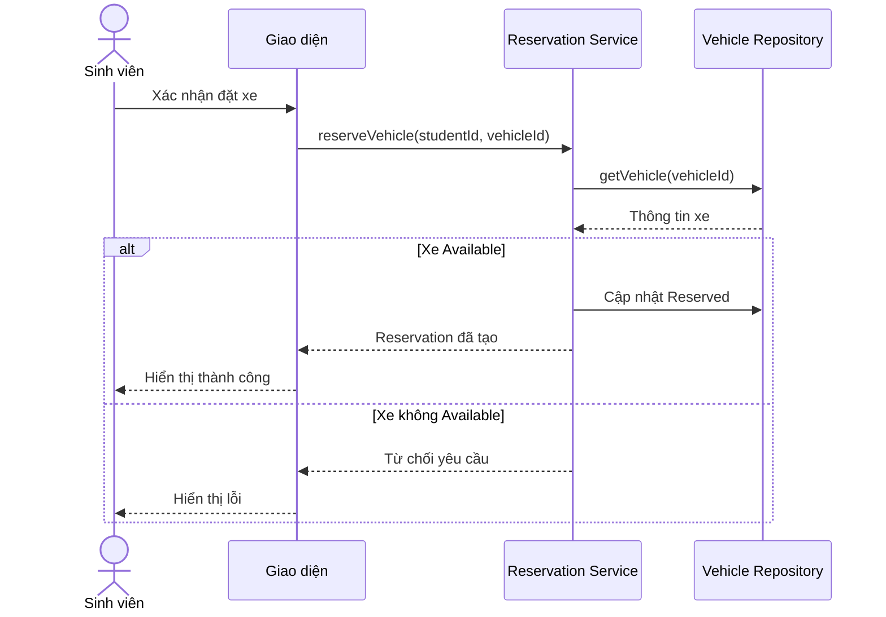
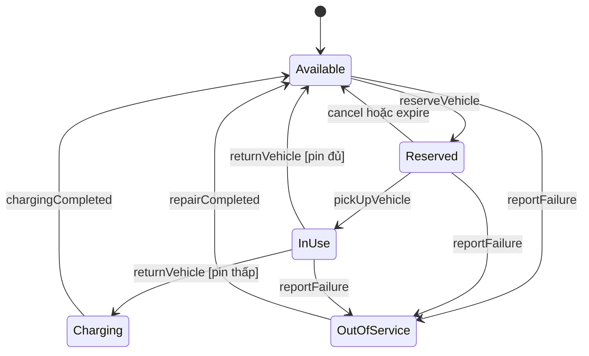
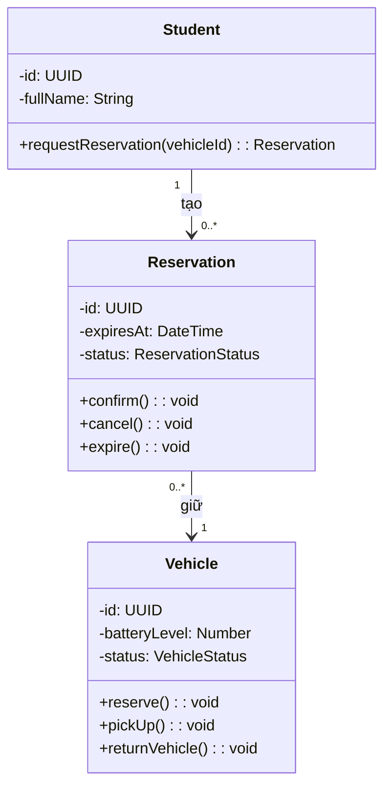
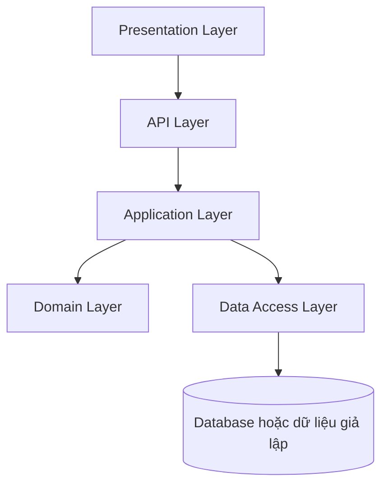
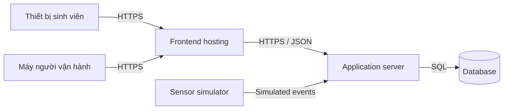

# Kiến thức chung cho bài tập lớn Công nghệ phần mềm

File này tổng hợp những kiến thức cả nhóm sẽ dùng xuyên suốt bài tập lớn Smart E-Mobility Hub. Mục đích là để các tài liệu ở từng phase được viết theo cùng một cách hiểu, không phải đến lúc ghép bài mới phát hiện requirement, diagram, UI và code đang mô tả những hệ thống khác nhau.

## 1. Công nghệ phần mềm không chỉ là viết code

Lập trình thường bắt đầu bằng câu hỏi:

> Viết code thế nào để thực hiện chức năng này?

Công nghệ phần mềm bắt đầu sớm hơn và đi xa hơn:

- Chúng ta đang giải quyết vấn đề gì?
- Ai cần hệ thống này?
- Họ muốn đạt mục tiêu gì?
- Hệ thống phải làm gì và không làm gì?
- Các quy tắc nghiệp vụ là gì?
- Hệ thống nên được chia thành những phần nào?
- Làm sao biết chức năng chạy đúng?
- Khi yêu cầu thay đổi, những tài liệu và phần code nào bị ảnh hưởng?
- Làm sao để nhiều thành viên cùng làm mà sản phẩm vẫn nhất quán?

Ví dụ, một API đặt xe có thể chỉ là:

```text
POST /reservations
```

Nhưng trước khi viết API, nhóm phải trả lời:

- Xe nào được phép đặt?
- Xe đang sạc có được đặt không?
- Một sinh viên được giữ bao nhiêu xe?
- Lượt đặt có hết hạn không?
- Hai người cùng đặt một xe thì xử lý thế nào?
- Khi hủy hoặc hết hạn, xe trở về trạng thái nào?
- Nếu xe gặp sự cố sau khi được đặt thì chuyện gì xảy ra?

Code là phần hiện thực hóa những quyết định đó. Nếu quyết định nghiệp vụ chưa rõ, code chạy được vẫn có thể là code sai.

## 2. Vòng đời phát triển phần mềm

Một vòng đời phát triển cơ bản:

```text
Lập kế hoạch
    ↓
Phân tích yêu cầu
    ↓
Thiết kế
    ↓
Cài đặt
    ↓
Kiểm thử
    ↓
Triển khai
    ↓
Vận hành và bảo trì
```

### Lập kế hoạch

Xác định mục tiêu, phạm vi, thời gian, thành viên, rủi ro và đầu ra của dự án.

### Phân tích yêu cầu

Xác định stakeholder, actor, functional requirement, non-functional requirement, business rule và use case.

### Thiết kế

Quyết định UI, quy trình, sự tương tác giữa các thành phần, class, module, kiến trúc và môi trường triển khai.

### Cài đặt

Biến thiết kế thành source code và MVP hoạt động được.

### Kiểm thử

Kiểm tra luồng thành công, trường hợp lỗi, quy tắc nghiệp vụ, chuyển trạng thái và yêu cầu chất lượng.

### Triển khai

Đưa frontend, backend và dữ liệu lên môi trường mà nhóm có thể demo.

### Bảo trì

Sửa lỗi, cập nhật yêu cầu, cải thiện chức năng và giữ tài liệu đồng bộ với sản phẩm.

Quy trình thực tế không đi thẳng một chiều. Khi thiết kế hoặc cài đặt, nhóm có thể phát hiện requirement chưa rõ và phải quay lại sửa.

## 3. Waterfall, Incremental và Agile

### Waterfall

Các giai đoạn chủ yếu diễn ra theo thứ tự:

```text
Requirement → Design → Implementation → Testing → Deployment
```

Ưu điểm là dễ theo dõi và có tài liệu rõ. Nhược điểm là nếu hiểu sai yêu cầu từ đầu, nhóm có thể chỉ phát hiện khi đã đi rất xa.

### Incremental

Hệ thống được xây thành từng phần có thể hoạt động:

```text
Increment 1: Xem Hub và xe
Increment 2: Đặt xe
Increment 3: Nhận và trả xe
Increment 4: Dashboard vận hành
Increment 5: What-if Simulation
```

Sau mỗi increment, sản phẩm có thêm một nhóm chức năng hoàn chỉnh.

### Iterative

Một chức năng được cải thiện qua nhiều vòng:

```text
Vòng 1: Đặt xe cơ bản
Vòng 2: Thêm hủy và hết hạn
Vòng 3: Thêm xử lý tranh chấp
Vòng 4: Thêm trường hợp xe gặp sự cố
```

### Agile

Agile nhấn mạnh vòng phản hồi ngắn, sản phẩm hoạt động sớm, hợp tác và khả năng thích nghi với thay đổi. Agile không có nghĩa là bỏ tài liệu, bỏ thiết kế hoặc code tùy ý.

Với bài tập lớn, các submission vẫn là mốc tuần tự, nhưng nhóm nên phát triển MVP theo từng vertical slice và review mỗi tuần.

### Vertical slice

Một vertical slice hoàn thành một luồng từ UI đến nghiệp vụ và dữ liệu:

```text
Xem xe → đặt xe → cập nhật trạng thái → hiển thị kết quả
```

Làm toàn bộ UI trước rồi mới làm toàn bộ backend là horizontal slicing. Cách đó có thể tạo ra nhiều màn hình nhưng chưa có luồng nào hoạt động trọn vẹn.

## 4. Từ bối cảnh đến requirement

Trình tự phân tích:

```text
Bối cảnh
   ↓
Vấn đề
   ↓
Stakeholder
   ↓
Mục tiêu
   ↓
Phạm vi
   ↓
Business rule
   ↓
Requirement
```

### Bối cảnh

Môi trường mà hệ thống tồn tại. Với đề tài này, bối cảnh là nhu cầu di chuyển giữa ga Metro, trường học, ký túc xá và khu dịch vụ trong Khu đô thị ĐHQG-HCM.

### Problem statement

Phát biểu khó khăn cần giải quyết, ai bị ảnh hưởng và hậu quả nếu không giải quyết.

### Stakeholder

Cá nhân hoặc tổ chức sử dụng, quản lý, cung cấp dữ liệu, chịu ảnh hưởng hoặc quan tâm đến hệ thống.

### Actor

Vai trò trực tiếp tương tác với hệ thống trong một use case. Một stakeholder không nhất thiết là actor; một hệ thống bên ngoài có thể là actor dù không phải con người.

### Goal

Kết quả nghiệp vụ dự án muốn đạt được, ví dụ giảm thiếu xe ở một Hub hoặc giảm thời gian chờ sạc.

### Scope

Những trách nhiệm thuộc hệ thống và những phần nằm ngoài dự án.

### System boundary

Ranh giới giữa phần mềm với con người hoặc hệ thống bên ngoài. Phần mềm có thể đề xuất điều phối, nhưng nhân viên mới là người vận chuyển xe ngoài thực tế.

### Assumption

Điều nhóm tạm xem là đúng để tiếp tục phân tích.

### Constraint

Giới hạn mà dự án hoặc giải pháp phải tuân theo, chẳng hạn thời gian, định dạng nộp bài hoặc yêu cầu phải có MVP.

## 5. Các loại requirement

### Functional requirement

Mô tả hệ thống phải làm gì.

```text
FR-RES-01: Hệ thống phải cho phép sinh viên đặt một phương tiện đang ở
trạng thái Available.
```

### Business rule

Mô tả quy tắc nghiệp vụ mà chức năng phải tuân theo.

```text
BR-RES-01: Một phương tiện chỉ có tối đa một lượt đặt đang hiệu lực tại
cùng một thời điểm.
```

### Non-functional requirement

Mô tả chất lượng hoặc điều kiện vận hành.

```text
NFR-SEC-01: Chỉ người dùng có vai trò Operator mới được thay đổi trạng thái
hoạt động của cổng sạc.
```

### Constraint

Mô tả giới hạn áp đặt lên dự án hoặc giải pháp.

```text
MVP không bắt buộc phải sử dụng backend database.
```

## 6. Requirement tốt phải có đặc điểm gì?

- Rõ ràng;
- Chỉ chứa một ý chính;
- Có lý do tồn tại;
- Khả thi;
- Không mâu thuẫn;
- Có thể kiểm tra;
- Có mã định danh;
- Liên kết được với stakeholder need và use case.

Requirement yếu:

```text
Hệ thống phải nhanh và dễ sử dụng.
```

Requirement tốt hơn:

```text
Danh sách Hub phải được hiển thị trong vòng 2 giây trong điều kiện dữ liệu
và số người dùng của môi trường demo.
```

Không đưa cách cài đặt vào requirement nghiệp vụ nếu không có constraint bắt buộc.

```text
Requirement: Sinh viên xem được các Hub phù hợp.
Solution: React gọi REST API để lấy danh sách Hub.
```

## 7. Các loại diagram dùng trong bài

| Diagram | Câu hỏi chính |
|---|---|
| Use-case diagram | Ai sử dụng hệ thống và muốn làm gì? |
| Activity diagram | Quy trình diễn ra qua những bước và nhánh nào? |
| Sequence diagram | Các thành phần trao đổi thông tin theo thứ tự nào? |
| State-machine diagram | Một đối tượng đổi trạng thái ra sao? |
| Class diagram | Hệ thống có những class nào và chúng liên quan thế nào? |
| Development view | Source code được chia thành project, module hoặc package nào? |
| Deployment view | Phần mềm chạy trên thiết bị và server nào? |

Các diagram không thay thế nhau. Chúng mô tả cùng hệ thống từ những góc nhìn khác nhau.

## 8. Use-case diagram

Use-case diagram gồm:

- Actor;
- Use case;
- System boundary;
- Association;
- Quan hệ `include`, `extend` hoặc generalization khi cần.

Tên use case thường dùng dạng động từ và đối tượng:

- Find Suitable Vehicle;
- Reserve Vehicle;
- Return Vehicle;
- Schedule Charging Session;
- Run What-if Simulation.

### `include`

Một use case luôn sử dụng hành vi của use case khác.

```text
Reserve Vehicle
    include → Check Vehicle Availability
```

### `extend`

Hành vi bổ sung chỉ xảy ra trong một điều kiện.

```text
Suggest Alternative Vehicle
    extend → Reserve Vehicle
```

Use-case diagram không mô tả thứ tự thời gian và không chứa nút bấm, API, controller hoặc database.

## 9. Use-case specification

Use-case diagram chỉ cho bức tranh tổng quan. Use-case specification mô tả chi tiết một mục tiêu.

Cấu trúc cơ bản:

```text
Use Case ID:
Use Case Name:
Primary Actor:
Supporting Actors:
Goal:
Trigger:
Preconditions:
Postconditions on success:
Postconditions on failure:
Main Flow:
Alternative Flows:
Exception Flows:
Related Business Rules:
Related Requirements:
```

Main flow cần xen kẽ actor và system:

```text
1. Sinh viên chọn một xe.
2. Hệ thống hiển thị thông tin xe.
3. Sinh viên xác nhận đặt xe.
4. Hệ thống kiểm tra lại trạng thái.
5. Hệ thống tạo lượt đặt.
6. Hệ thống thông báo thành công.
```

Không chỉ viết luồng thành công. Cần có trường hợp xe không còn sẵn sàng, lượt đặt hết hạn, Hub đã đầy hoặc tài nguyên gặp sự cố.

## 10. Activity diagram

Activity diagram mô tả quy trình nghiệp vụ:

- Điểm bắt đầu;
- Các hành động;
- Thứ tự;
- Decision và guard condition;
- Hoạt động song song;
- Điểm kết thúc;
- Swimlane nếu có nhiều bên chịu trách nhiệm.

Ví dụ đặt xe:



Activity diagram tập trung vào quy trình, không tập trung vào API hoặc class nào gọi nhau.

## 11. Sequence diagram

Sequence diagram mô tả các participant trao đổi message theo thời gian. Thời gian đi từ trên xuống dưới.

Các thành phần thường gặp:

- Actor;
- UI hoặc boundary;
- Controller;
- Application service;
- Entity;
- Repository;
- Hệ thống bên ngoài.

Ví dụ:



Activity diagram trả lời quy trình đi qua những bước nào. Sequence diagram trả lời ai gửi message cho ai.

## 12. State-machine diagram

State diagram mô tả vòng đời một đối tượng. Nó phù hợp với Vehicle, Reservation, Parking Space, Charging Point, Charging Session và Incident.

Một transition có thể có dạng:

```text
event [guard] / action
```

Ví dụ vòng đời Vehicle:



State phải ảnh hưởng đến hành vi. Màu xe là thuộc tính; `Available` hoặc `OutOfService` là trạng thái nghiệp vụ.

## 13. Class diagram

Class diagram mô tả:

- Class;
- Thuộc tính;
- Method;
- Quan hệ;
- Multiplicity;
- Inheritance, association hoặc composition.

Ví dụ rút gọn:



Multiplicity:

| Ký hiệu | Ý nghĩa |
|---|---|
| `1` | Chính xác một |
| `0..1` | Không có hoặc có một |
| `0..*` | Không có hoặc có nhiều |
| `1..*` | Ít nhất một |

Class diagram khác database schema. Class diagram mô tả cả hành vi; database schema chủ yếu mô tả cách lưu dữ liệu.

## 14. Method description

Submission #3 yêu cầu mô tả tất cả method trên class diagram.

Một method description cần có:

- Class;
- Tên và signature;
- Mục đích;
- Parameters;
- Return value;
- Preconditions;
- Postconditions;
- Exceptions;
- Side effects.

Ví dụ:

```text
Class: ReservationService
Method: reserveVehicle(studentId: UUID, vehicleId: UUID): Reservation

Mục đích:
Tạo một lượt đặt xe cho sinh viên.

Preconditions:
- Sinh viên tồn tại
- Xe đang Available
- Sinh viên chưa có lượt đặt đang hiệu lực

Postconditions:
- Reservation được tạo
- Xe chuyển sang Reserved
- Reservation có thời điểm hết hạn

Exceptions:
- StudentNotFound
- VehicleNotFound
- VehicleUnavailable
- ActiveReservationAlreadyExists
```

## 15. Kiến trúc phần mềm

Kiến trúc mô tả các thành phần lớn, trách nhiệm và dependency giữa chúng.

Một kiến trúc phân lớp phù hợp với MVP:



Backend có thể tổ chức thành modular monolith:

```text
backend/src/modules/
├── identity/
├── hubs/
├── vehicles/
├── reservations/
├── charging/
├── operations/
└── simulation/
```

Modular monolith vẫn là một backend được triển khai cùng nhau nhưng code có ranh giới module rõ. Cách này phù hợp hơn microservices đối với phạm vi MVP của nhóm.

Hai nguyên tắc quan trọng:

- **High cohesion:** những chức năng cùng trách nhiệm được đặt gần nhau;
- **Low coupling:** các module không phụ thuộc chồng chéo không cần thiết.

## 16. Development view

Development view mô tả cách source code được tổ chức:

- Có những project nào;
- Có những module hoặc package nào;
- Module nào phụ thuộc module nào;
- Shared code nằm ở đâu.

Ví dụ:

```text
smart-e-mobility-hub/
├── frontend/
│   └── src/
│       ├── features/
│       ├── components/
│       └── api/
├── backend/
│   └── src/
│       ├── modules/
│       ├── shared/
│       └── app.ts
└── docs/
```

Development view không cho biết phần mềm chạy trên server nào. Đó là nhiệm vụ của deployment view.

## 17. Deployment view

Deployment view mô tả môi trường thực thi:

- Thiết bị người dùng;
- Frontend hosting;
- Backend server;
- Database hoặc dữ liệu giả lập;
- Hệ thống bên ngoài;
- Giao thức kết nối.



Deployment view phải phản ánh hệ thống mà nhóm thực sự có thể triển khai và giải thích. Không thêm Kubernetes, message broker hoặc nhiều service chỉ để diagram trông phức tạp.

## 18. Kiểm thử phần mềm

### Unit test

Kiểm tra một hàm hoặc class riêng lẻ, ví dụ `Vehicle.reserve()`.

### Integration test

Kiểm tra nhiều thành phần phối hợp, ví dụ `ReservationService`, `VehicleRepository` và `ReservationRepository`.

### System test

Kiểm tra toàn bộ luồng qua UI, backend và dữ liệu.

### Acceptance test

Kiểm tra hệ thống có đáp ứng điều kiện chấp nhận của stakeholder hay không.

Các nhóm trường hợp cần kiểm tra:

- Positive case;
- Negative case;
- Boundary case;
- State transition;
- Authorization;
- Concurrency;
- Failure và recovery.

Ví dụ đặt xe:

| Trường hợp | Kết quả mong đợi |
|---|---|
| Xe Available | Tạo reservation, xe thành Reserved |
| Xe Reserved | Từ chối, không tạo reservation |
| Xe Charging | Từ chối |
| Sinh viên đã có lượt đặt | Từ chối theo business rule |
| Hai người cùng đặt một xe | Chỉ một người thành công |
| Reservation hết hạn | Xe trở về trạng thái phù hợp |

Test case là bonus ở Submission #3, nhưng MVP vẫn phải được kiểm tra để demo ổn định.

## 19. Verification và validation

**Verification:** nhóm có xây hệ thống đúng theo requirement và thiết kế không?

**Validation:** requirement và sản phẩm có giải quyết đúng nhu cầu người dùng không?

```text
Verification = xây đúng theo đặc tả
Validation   = xây đúng sản phẩm cần xây
```

## 20. Traceability

Traceability theo dõi một nhu cầu từ đầu đến cuối:

```text
Stakeholder need
    ↓
Requirement
    ↓
Use case
    ↓
Activity và Sequence
    ↓
Class và Method
    ↓
Code và API
    ↓
Test case
    ↓
Demo
```

Ví dụ:

| Need | Requirement | Use case | UI/diagram | Module | Test |
|---|---|---|---|---|---|
| Sinh viên giữ trước một xe | FR-RES-01 | UC-ST-02 | Reserve Vehicle | Reservation | TC-RES-01 |

Nếu requirement không xuất hiện trong thiết kế, code hoặc test, requirement đó chưa được hiện thực đầy đủ. Nếu code có chức năng không liên kết được với requirement nào, cần kiểm tra chức năng đó có nằm trong phạm vi không.

## 21. Các khái niệm chính của Smart E-Mobility Hub

### Mobility Hub

Địa điểm tập trung phương tiện, chỗ đỗ và cổng sạc.

### Vehicle

Phương tiện điện dùng chung hoặc phương tiện cá nhân liên quan đến việc đỗ và sạc.

### Parking Space

Vị trí đỗ thuộc một Hub, có trạng thái riêng.

### Charging Point

Cổng sạc tại Hub, có trạng thái và lịch sử dụng.

### Reservation

Lượt giữ trước xe, chỗ đỗ hoặc tài nguyên theo quy tắc nghiệp vụ.

### Trip/Rental

Quá trình sinh viên nhận, sử dụng và trả phương tiện dùng chung.

### Charging Request và Charging Session

Charging Request là nhu cầu sạc được gửi vào hệ thống. Charging Session là phiên sạc đã được xếp và thực hiện.

### Operational Incident

Sự cố ảnh hưởng đến xe, cổng sạc, Hub hoặc khả năng phục vụ.

### Redistribution

Điều chuyển phương tiện giữa các Hub để giảm nơi thừa xe và bổ sung nơi thiếu xe.

### What-if Simulation

Mô phỏng một tình huống giả định trên trạng thái hiện tại mà không thay đổi trực tiếp dữ liệu vận hành thật.

### Coordination Recommendation

Khuyến nghị được tạo từ trạng thái hoặc kết quả mô phỏng, ví dụ chuyển xe, điều chỉnh lịch sạc hoặc hướng người dùng sang Hub khác.

## 22. Các phase phải nối với nhau

### Phase 1

Trả lời:

> Hệ thống cần làm gì và vì sao?

Đầu ra chính: context, stakeholder, scope, requirements, use-case diagram và use-case detail.

### Phase 2

Trả lời:

> Người dùng tương tác thế nào và hệ thống xử lý luồng ra sao?

Đầu ra chính: UI mockup, sequence diagram, activity diagram và state-chart diagram nếu làm bonus.

### Phase 3

Trả lời:

> Hệ thống được cấu tạo và triển khai thế nào?

Đầu ra chính: architectural design, development view, deployment view, class diagram, class/method description và test case nếu làm bonus.

### Final

Gộp các phase thành một tài liệu thống nhất, trình bày chuỗi màn hình của MVP và khai báo việc sử dụng Generative AI.

## 23. Quy tắc giữ tài liệu nhất quán

1. Dùng cùng một glossary;
2. Mỗi requirement có ID;
3. Mỗi use case liên kết với requirement;
4. Tên trên diagram khớp với tên trong tài liệu;
5. Trạng thái trong requirement, UI, diagram và code phải giống nhau;
6. Method trên sequence diagram phải xuất hiện trong class hoặc component liên quan;
7. Mỗi luồng lỗi quan trọng phải có cách xử lý;
8. Mỗi thay đổi nghiệp vụ phải được kiểm tra tác động lên các phase;
9. Không vẽ thành phần mà nhóm không triển khai hoặc không giải thích được;
10. Mỗi thành viên phải đọc được toàn bộ hệ thống, không chỉ phần cá nhân.

Ví dụ khi đổi business rule từ “mọi xe Available đều được đặt” sang “xe Available nhưng pin dưới 20% không được đặt”, nhóm phải kiểm tra lại:

- Functional requirement;
- Business rule;
- Use-case detail;
- Activity diagram;
- Sequence diagram;
- State diagram;
- UI;
- Class và method;
- Code;
- Test case.

## 24. Definition of Done cho một chức năng

Một chức năng chỉ được xem là hoàn thành khi:

- Có requirement;
- Có business rule;
- Có use-case specification;
- Có diagram cần thiết;
- UI hỗ trợ main flow và error flow;
- Class/module chịu trách nhiệm đã rõ;
- Code chạy được;
- Dữ liệu và trạng thái thay đổi đúng;
- Có kiểm tra luồng thành công và thất bại;
- Thuật ngữ thống nhất;
- Được một thành viên khác review;
- Có thể demo lại từ đầu.

“Đã code xong” không đồng nghĩa với “đã hoàn thành”.

## 25. Mười điều cần nhớ

1. Bắt đầu từ vấn đề, không bắt đầu từ công nghệ.
2. Stakeholder và actor không hoàn toàn giống nhau.
3. Scope phải nói rõ cả phần làm và không làm.
4. Requirement phải rõ và kiểm tra được.
5. Business rule phải được dùng thống nhất ở mọi tài liệu.
6. Mỗi diagram trả lời một câu hỏi khác nhau.
7. MVP nên nhỏ nhưng có luồng nghiệp vụ và trạng thái thật.
8. Không chỉ thiết kế và kiểm thử happy path.
9. Requirement, diagram, UI, code và test phải kể cùng một câu chuyện.
10. What-if Simulation là điểm phân biệt dự án này với một ứng dụng thuê xe thông thường.
